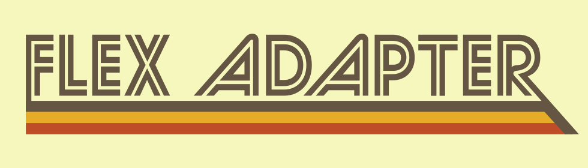

<h1 align="center">
    
</h1>

### Define and coordinate items in a RecyclerView without boilerplate.

* Multiple item layouts in a single adapter with no typecasting
* Per-item swipe and drag behavior
* Display ten of thousands of items without dropping frames

# Usage

#### Check this out:

The examples here will be in Kotlin, but this library works just as well with Java.

```kotlin
// Create the adapter
val adapter = FlexAdapter()
recyclerView.adapter = adapter
recyclerView.layoutManager = GridLayoutManager(this, 3).apply {
    // This line is all that's required to enable per-item spans
    spanSizeLookup = adapter.spanSizeLookup
}
// This line is all that's required to enable per-item swpe and drag
adapter.itemTouchHelper.attachToRecyclerView(recyclerView)
```

##### Define item types like this:

``` kotlin
// This item will be a text header with a span of three that can be swiped horizontally to dismiss.
class TextItem(var text: String) :
        FlexAdapterExtensionItem(R.layout.item_text, span = 3, swipeDirs = HORIZONTAL) {
    override fun bindItemView(itemView: View, position: Int) {
        itemView.text_view.text = text
    }
}

// This will be a picture loaded from a resource the can be reordered by draggin in any direction.
class PictureItem(@DrawableRes val imageRes: Int) :
        FlexAdapterExtensionItem(R.layout.item_picture, dragDirs = ALL_DIRS) {
    override fun bindItemView(itemView: View, position: Int) {
        itemView.image_view.setImageResource(imageRes)
    }
}
```

##### Then add some items:

```kotlin
adapter.addItems(listOf(
    TextItem("Look at these pictures"),
    PictureItem(R.drawable.picture_1),
    PictureItem(R.drawable.picture_2)
))
```

#### Update an existing item:

```kotlin
// If we added this TextItem earlier
textItem.text = "Look at this new text"
adapter.notifyItemChanged(textItem)
```

That's it. No managing indices. No casting from interfaces or Object. 
Just fast, simple code that does exactly what you want.

# Sample project

There is a sample app [here](sample/src/main/java/com/github/ajalt/flexadapter/sample/MainActivity.kt). 
The entire activity is only about 100 lines of code.

# Download

FlexAdapter is distributed with [JitPack](https://jitpack.io)

```groovy
repositories {
    maven { url "https://jitpack.io" }
}

dependencies {
   compile 'com.github.ajalt:flexadapter:1.0.0'
}
```


# License
```
Copyright 2016 AJ Alt

Licensed under the Apache License, Version 2.0 (the "License");
you may not use this file except in compliance with the License.
You may obtain a copy of the License at

http://www.apache.org/licenses/LICENSE-2.0

Unless required by applicable law or agreed to in writing, software
distributed under the License is distributed on an "AS IS" BASIS,
WITHOUT WARRANTIES OR CONDITIONS OF ANY KIND, either express or implied.
See the License for the specific language governing permissions and
limitations under the License.
```